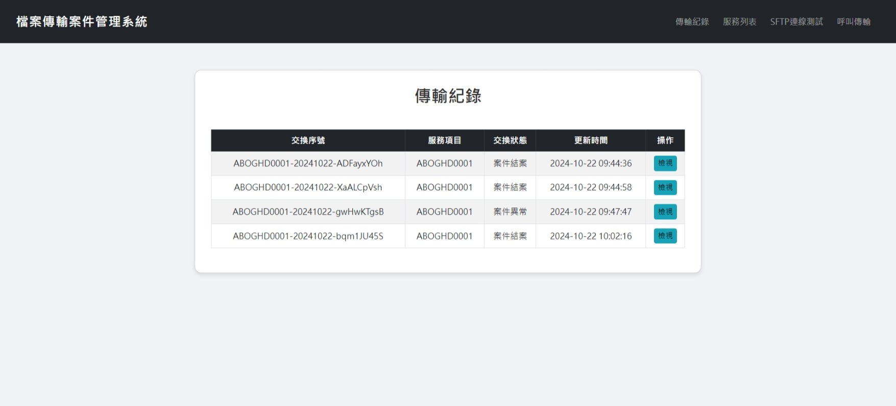
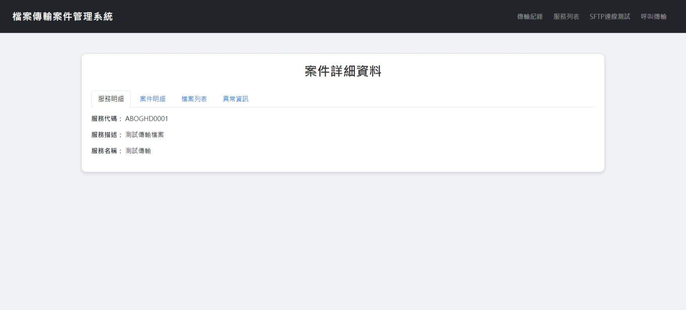
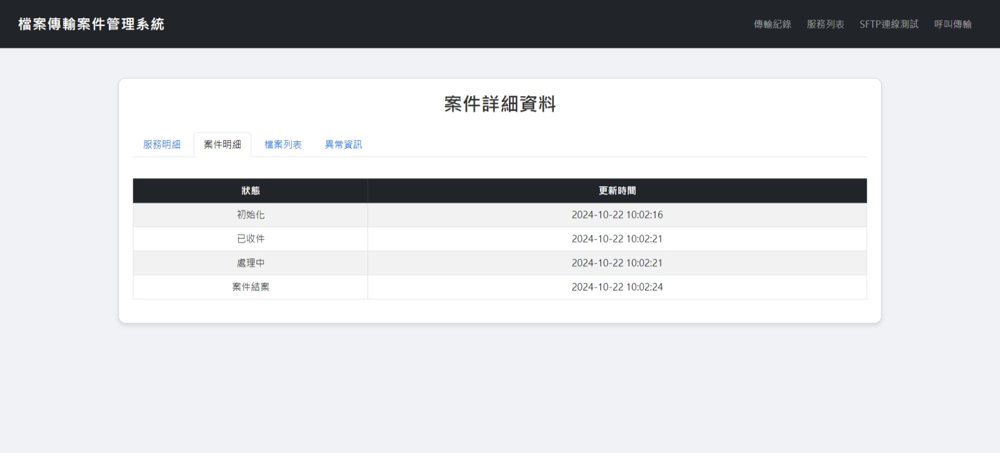
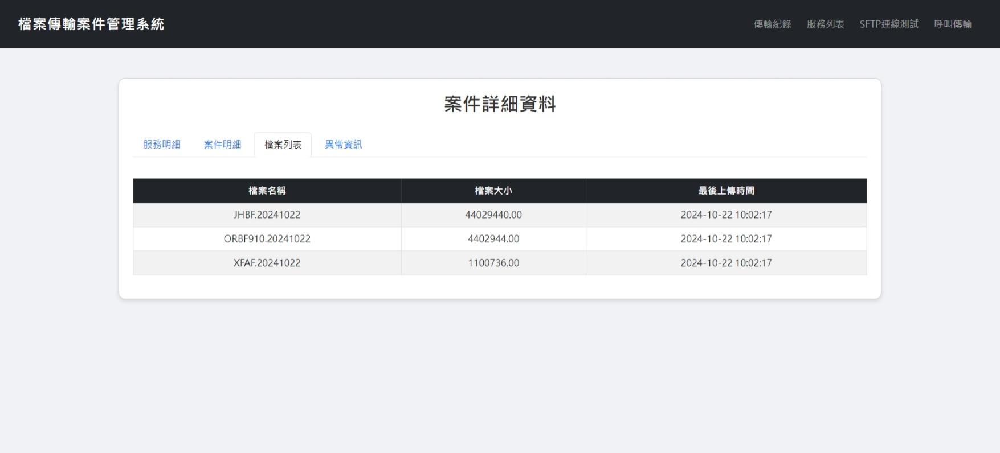
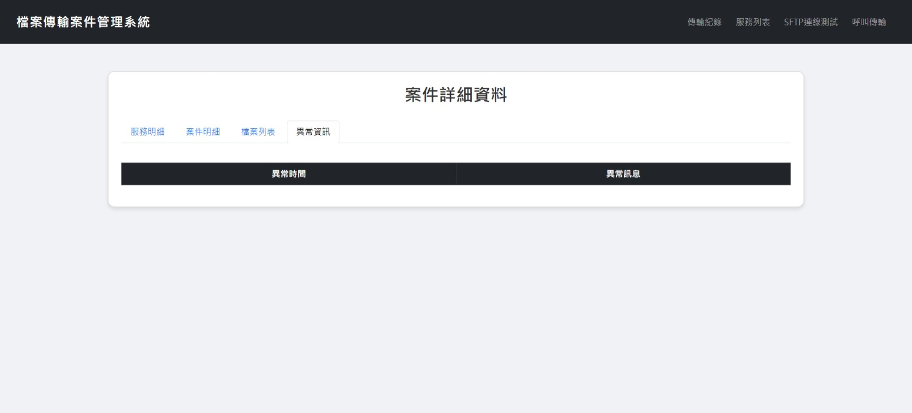
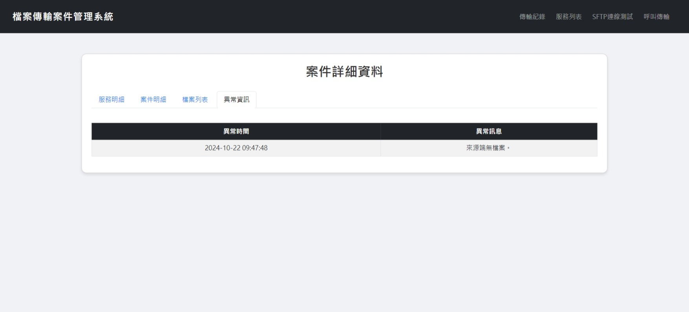
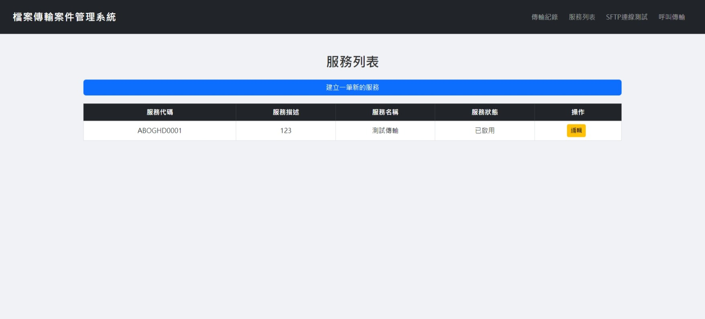
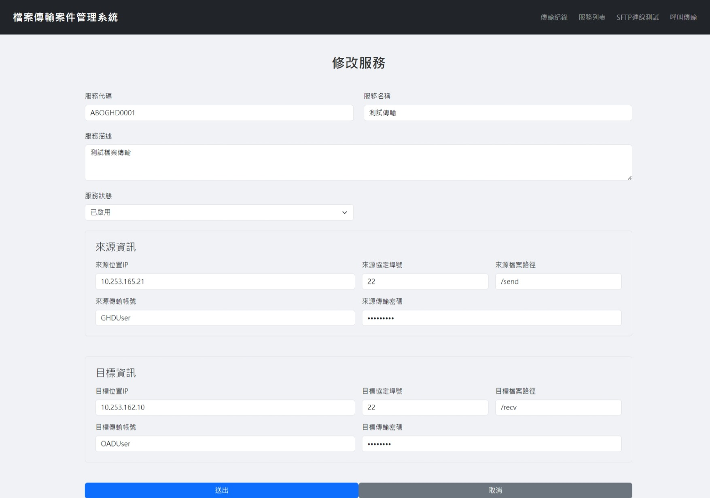
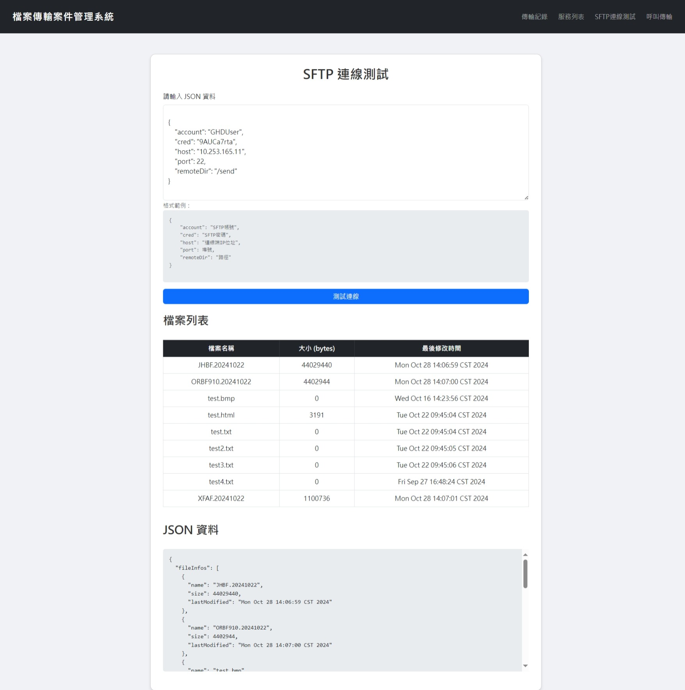
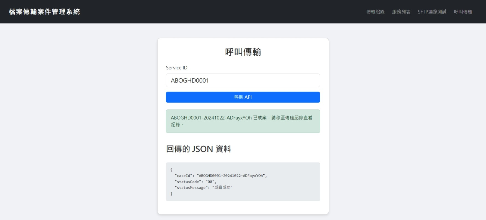

# FilesFlowTransHub 檔案傳輸案件管理系統

>當需要資訊系統自動化檔案傳輸進行集中管理，以有效稽核追蹤檔案傳輸紀錄及統計資料傳輸應用的績效時，本系統提供自動化檔案傳輸記錄及管理功能，解決跨系統傳輸檔案管理成本高昂且紀錄彙整錯誤繁瑣的問題。本系統可自動化執行依據註冊好的傳輸服務，取得來源與目的端的連線資訊，從來源端檔案伺服器下載檔案，並自動上傳至目的端伺服器。
>
>跨資訊系統整合時，亦可透過 REST API 發動檔案傳輸作業，系統則會將所有傳輸狀態與交換歷程詳細記錄至資料庫。透過簡單的管理介面，使用者能方便管理檔案傳輸設定與查看傳輸生命週期的紀錄，達到提升檔案傳輸效率與有效應用管理傳輸紀錄之目的。

## 1.所用技術

- Spring Boot
- Spring Data JPA
- Hibernate
- H2 Database Engine
- Thymeleaf

## 2.使用情境

- 即時檔案連線測試，用戶可以透過管理介面或 REST API 進行 SFTP 連線測試，實時檢查來源端與目的端的 SFTP 伺服器狀態，確認連線是否正常。這有助於快速排除連線問題，保障檔案傳輸的順利進行。
- 檔案傳輸記錄查詢，用戶可以查看所有檔案傳輸的歷史記錄，了解每次傳輸的詳細資訊，包括開始時間、結束時間、傳輸狀態及詳細歷程。這對於需要追蹤檔案流向或檢查傳輸失敗原因的情況非常重要。
- 服務設定管理，用戶可以透過介面新增、修改、刪除 SFTP 伺服器的資訊，包括主機位址、埠號、使用者名稱等。這使得服務設定變得靈活，能夠適應不同的業務需求。
- API 整合，開發人員可以利用提供的 REST API，將檔案傳輸功能整合到其他應用系統中，亦可撰寫批次程式來定期呼叫達到自動化工作流程，進而提升業務效率。

## 3.功能介绍

- **來源端與目的端設定**：
 
  - 透過介面新增、修改、刪除來源端與目的端的 SFTP 伺服器資訊。
 
  - 設定項目包括：主機位址、埠號、使用者名稱、密碼、檔案路徑等。

- **檔案傳輸**：
  
  - 使用者可透過 REST API 發送檔案傳輸請求，請求中包含服務代碼。
  
  - 系統會自動從來源端下載指定檔案，並上傳至目的端 SFTP 伺服器。
- **檔案傳輸記錄**：

  - 系統自動記錄每次檔案傳輸的詳細資訊，包括：

    - 開始時間：檔案傳輸的起始時間。

    - 結束時間：檔案傳輸的結束時間。

    - 傳輸狀態：成功或失敗等狀態。

    - 詳細歷程：完整的傳輸過程日誌。
- **SFTP連線測試**： 

  - 可以用API方式呼叫。
  - 即時檢查來源端與目的端的 SFTP 伺服器連線狀態。
  - 列出指定 SFTP 伺服器上的檔案名稱、檔案大小、最後修改時間。


## 4.下載

你可以使用 `git` 將項目clone下載下來：

```bash
git clone https://gitlab.iisigroup.com/ps150/g-p231301/modapc/filesflowtranshub
cd FilesFlowTransHub
```

## 5.編譯

```
mvn clean package
```

## 6.執行

```
##產生測試憑證
keytool -genkey -alias FFT -storetype PKCS12 -keyalg RSA -keystore keystore.p12 -storepass 測試憑證密碼 -validity 365

java -DDB_USERNAME=h2 帳號 -DDB_PASSWORD=h2 密碼 -DKEYSTORE_PATH=測試憑證路徑 -DKEYSTORE_PASSWORD=測試憑證密碼 -jar target/FilesFlowTransHub-0.0.1-SNAPSHOT.jar
```

## 7.使用說明

1. 傳輸記錄：使用者可以在此查看所有傳輸紀錄。每筆紀錄提供以下資訊：

- 服務明細：顯示註冊的服務相關資訊。

- 案件明細：顯示整個案件的傳輸歷程，包括每一步的狀態更新。

- 檔案列表：列出系統所傳送的檔案清單。
- 異常資訊：若傳輸過程中發生異常，將會在這裡呈現相關的錯誤訊息。

案件狀態碼：

| 案件狀態碼 | 案件說明 |狀態代碼描述|
| ------ | ------ |------ |
|  00    |  初始化      |系統收到API請求傳檔訊息
|  01    |  已收件      |系統已從來源端下載檔案下來
|  02    |  傳送中      |系統正將檔案傳送到目標端中
|  10    |  結案      |檔案傳輸流程結束
|  97    |  異常      |檔案傳輸流程中，發生異常，需去查看相關訊息

2. 服務列表：使用者需在此註冊傳輸資訊，包括來源與目標端的相關資訊。所有服務必須預先註冊，才能執行檔案的傳輸動作。


3. SFTP連線測試：使用者可以在此測試 SFTP 連線狀況。若測試成功，系統將回傳連線端的檔案資訊，幫助使用者確認連線是否正常。

4. 呼叫傳輸：使用者可以在此呼叫檔案傳輸的 API。若檔案傳輸成功，使用者可至**傳輸紀錄**中查看具體的傳輸狀況。

備註：**SFTP 連線測試**與**呼叫傳輸**功能亦可以通過 REST API 的方式呼叫，詳細的 API 使用說明將在**API使用**的章節說明。

## 8.API 使用

1. 使用 Postman ```POST``` 方式，進行 ```SFTP連線測試``` 功能：
```
https://localhost:30010/api/connectionTest
```

```SFTP連線測試``` 參數：
| 欄位 | 必填|型態|說明 |範例|
| ------   | ------ |------ |------ |------ |
|account   |Y |String|帳號|testUser
|cred  |Y |String|密碼|1qaz!QAZ
|host      |Y |String|主機IP|127.0.0.1
|port      |Y |Int|主機埠號 |22
|remoteDir |Y |String|資料夾路徑|/stsapp/xfs/log

```
{
    "account": "XXX",
    "cred": "XXXX",
    "host": "127.0.0.1",
    "port": 22,
    "remoteDir":"/D:/temp/send/"
}
```

```SFTP連線測試```回傳成功資訊：
| 欄位 | 說明 |
| ------ | ------ |
|name         |檔案名稱         |
|size         |檔案大小      |
|lastModified |最後修改時間  |
```
{
    "fileInfos": [
        {
            "name": "test.txt",
            "size": 25536,
            "lastModified": "Wed Sep 25 16:23:03 CST 2024"
        },
        {
            "name": "test2.txt",
            "size": 0,
            "lastModified": "Wed Sep 11 09:15:47 CST 2024"
        }
    ]
}
```


2. 使用 Postman ```POST``` 方式，進行 ```呼叫傳送檔案``` 功能：
```
https://localhost:30010/api/callService
```

```呼叫傳送檔案```所需參數：
| 欄位 |必填  |型態|說明|範例|
| ------ | ------ |------ |------ |------ |
|serviceId|Y      |String|傳輸代碼|XNAEBC0001

```
{
    "serviceId": "1234567890"
}
```

```呼叫傳送檔案```回傳資訊：
| 欄位 | 說明 |
| ------ | ------ |
|caseId        |案號        |
|statusCode    |狀態碼        |
|statusMessage |案件訊息        |

```成功```將回傳案號與案件訊息：
```
{
    "caseId": "1234567890-20240927-QYTzEYMt6",
    "statusCode": "00",
    "statusMessage": "成案成功"
}
```

```失敗```將回傳成案失敗訊息：

```
{
    "caseId": null,
    "statusCode": "97",
    "statusMessage": "此 serviceId 不存在或未開放"
}
```
## 9.系統畫面

1. 傳輸紀錄：












2. 服務列表：





3. SFTP連線測試：



4. 呼叫傳輸：



## 10.常見問題
如果成案失敗的話，請檢查以下幾點：
- serviceId是否有註冊、開放。
- 欄位名稱是否正確。

如果遇到連接失敗的錯誤，請檢查以下幾點：
- SFTP 伺服器 IP 和 PORT 是否正確。
- 帳號和密碼是否正確。
- 防火牆是否允許指定 PORT 通過。
- Windows 系統的路徑需以斜線開頭，例如：```/D:/path```。